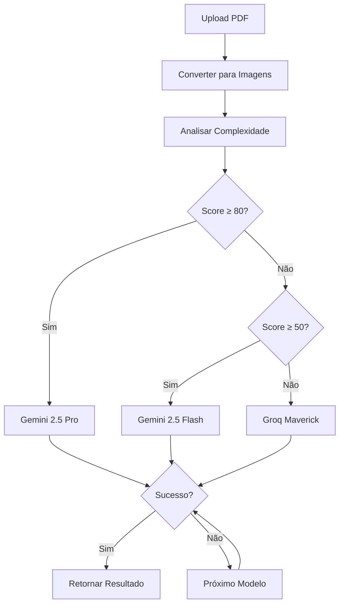

# 📄 OCR Híbrido Pro v5.0

Sistema inteligente de OCR com fallback em cascata, suportando múltiplos modelos de IA para extração de texto de PDFs com máxima precisão.

[](https://SEU_APP.streamlit.app)

---

## ✨ Funcionalidades

- 🤖 **4 Modelos de IA**: Gemini 2.5 Pro, Gemini 2.5 Flash, Groq Llama 4 Maverick, Groq Llama 4 Scout
- 🔄 **Fallback Inteligente**: Se um modelo falha, tenta automaticamente o próximo
- 🎯 **Análise de Complexidade**: Classifica páginas e escolhe a melhor estratégia
- 🔁 **Retry Automático**: Backoff exponencial para lidar com rate limits
- 📊 **Estatísticas Detalhadas**: Métricas completas de performance por modelo
- 💾 **Download de Resultados**: JSON estruturado e TXT simples
- 🎨 **Interface Moderna**: UI intuitiva e responsiva

---

## 🚀 Demo

[**Experimentar agora**](https://SEU_APP.streamlit.app)


---

## 🛠️ Tecnologias

- **Frontend**: Streamlit
- **OCR**: Gemini API, Groq API
- **Processamento**: pdf2image, Pillow, NumPy
- **Deploy**: Streamlit Cloud

---

## 📦 Instalação Local

### Pré-requisitos
- Python 3.9+
- Poppler (para pdf2image)

### Passos

```bash
# Clone o repositório
git clone https://github.com/SEU_USUARIO/ocr-hibrido-pro.git
cd ocr-hibrido-pro

# Instale dependências Python
pip install -r requirements.txt

# Linux/Mac: Instalar Poppler
sudo apt-get install poppler-utils  # Ubuntu/Debian
brew install poppler                 # macOS

# Windows: Baixar binários
# https://github.com/oschwartz10612/poppler-windows/releases/

# Configure as API Keys
# Crie .streamlit/secrets.toml:
cat > .streamlit/secrets.toml << EOF
GEMINI_API_KEY = "sua_key_aqui"
GROQ_API_KEY = "sua_key_aqui"
EOF

# Execute
streamlit run app.py
```

---

## 🔑 Obter API Keys

### Gemini API
1. Acesse [Google AI Studio](https://ai.google.dev)
2. Faça login
3. Clique em "Get API Key"
4. **Gratuito**: 60 requisições/minuto

### Groq API
1. Acesse [Groq Console](https://console.groq.com)
2. Crie conta
3. Gere API Key
4. **Gratuito**: 30 requisições/minuto

---

## 📖 Como Usar

### 1. Upload
- Arraste ou selecione arquivo PDF
- Limite: 50MB

### 2. Processar
- Clique em "Processar PDF"
- Acompanhe progresso em tempo real

### 3. Resultados
- **Aba Estatísticas**: Métricas de performance
- **Aba Resultados**: Texto extraído por página
- **Aba Download**: JSON completo ou TXT simples

---

## 🎯 Estratégias de Processamento

O sistema analisa a complexidade de cada página (0-100) e escolhe automaticamente:

| Score | Tipo | Estratégia |
|-------|------|-----------|
| ≥ 80 | Muito Complexa | Gemini 2.5 Pro (10 retries) → Fallback |
| 50-79 | Média | Gemini 2.5 (3 retries) → Groq |
| < 50 | Simples | Groq direto (5 retries) |

---

## 📊 Performance

Métricas típicas em produção:

- **Taxa de Sucesso Geral**: 95%+
- **Tempo Médio/Página**: 3-8 segundos
- **Gemini 2.5 Pro**: 98% sucesso, 8s médio
- **Groq Llama 4**: 92% sucesso, 3s médio

---

## 🏗️ Arquitetura



---

## 🔧 Configuração Avançada

### Ajustar DPI
```python
# Em app.py, classe Config:
DPI = 150  # Padrão (melhor qualidade)
DPI = 100  # Performance (mais rápido)
```

### Limites de Retry
```python
# Em Config.ESTRATEGIAS:
'sequencia': [
    {'modelo': 'gemini_25', 'retries': 10},  # Aumentar/diminuir
]
```

### Rate Limiting
```python
# Em RateLimiter:
RateLimiter(max_requests=25, window=60)  # Ajustar conforme necessidade
```

---

## 📝 Estrutura do Projeto

```
ocr-hibrido-pro/
├── app.py                  # Aplicação principal
├── requirements.txt        # Dependências Python
├── packages.txt           # Dependências do sistema
├── .streamlit/
│   └── config.toml        # Configurações do Streamlit
├── README.md              # Este arquivo
└── GUIA_DEPLOY.md         # Guia de deploy detalhado
```

---

## 🐛 Resolução de Problemas

### Erro: "poppler not found"
```bash
# Ubuntu/Debian
sudo apt-get install poppler-utils

# macOS
brew install poppler
```

### Erro: Rate Limit
- Sistema já tem controle de rate limit
- Se persistir, aguarde 1 minuto e tente novamente

### Erro: Memory
- Reduza DPI para 100
- Processe PDFs menores

---

## 🤝 Contribuindo

Contribuições são bem-vindas!

1. Fork o projeto
2. Crie uma branch: `git checkout -b feature/nova-feature`
3. Commit: `git commit -m 'Add nova feature'`
4. Push: `git push origin feature/nova-feature`
5. Abra Pull Request

---

## 📄 Licença

MIT License - veja [LICENSE](LICENSE) para detalhes.

---

## 👤 Autor

**Seu Nome**
- GitHub: [@seu_usuario](https://github.com/seu_usuario)
- LinkedIn: [Seu Nome](https://linkedin.com/in/seu-perfil)

---

## 🙏 Agradecimentos

- [Streamlit](https://streamlit.io) - Framework incrível
- [Google Gemini](https://ai.google.dev) - Modelos de IA poderosos
- [Groq](https://groq.com) - Inferência ultrarrápida
- Comunidade Open Source

---

## 📮 Suporte

Encontrou um bug ou tem uma sugestão?

- [Abrir Issue](https://github.com/SEU_USUARIO/ocr-hibrido-pro/issues)
- [Discussões](https://github.com/SEU_USUARIO/ocr-hibrido-pro/discussions)

---

<div align="center">

**⭐ Se este projeto te ajudou, considere dar uma estrela!**

Made with ❤️ and ☕

</div>